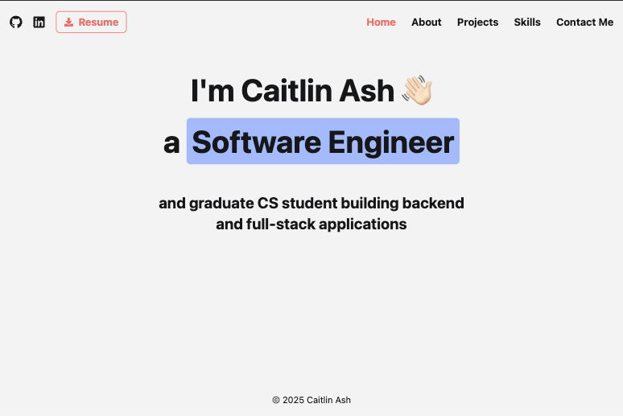

# Caitlin Ash | Portfolio

## Overview
A modern, responsive portfolio website showcasing my journey as a DevOps and SRE Engineer and Computer Science master's student. Built with Next.js and TailwindCSS, featuring a terminal-style skills section and clean, professional design.

## Table of Contents
  - [Overview](#overview)
  - [Table of Contents](#table-of-contents)
  - [Live Demo](#live-demo)
  - [Features](#features)
  - [Technology Stack](#technology-stack)
  - [Sections](#sections)
  - [Quick Start](#quick-start)
  - [Design System](#design-system)
  - [Key Features Explained](#key-features-explained)
    - [Terminal Skills Section](#terminal-skills-section)
    - [Component Architecture](#component-architecture)
    - [Performance Optimizations](#performance-optimizations)
  - [Performance Metrics](#performance-metrics)
  - [Deployment](#deployment)
  - [Future Enhancements](#future-enhancements)
  - [Connect With Me](#connect-with-me)

## Live Demo

🌐 **[View Live Website](https://caitlinash.io/)**



---

## Features

✨ **Modern Design**
- Clean, minimal interface with consistent styling
- Smooth page transitions and hover effects
- Mobile-responsive hamburger navigation

🖥️ **Terminal**
- Custom-coded skills display mimicking a real terminal
- Syntax-highlighted JavaScript object representation
- Currently learning section with dynamic content

🎨 **Design System**
- Custom CSS variables for consistent theming
- TailwindCSS utility-first approach
- Reusable component architecture

📱 **Responsive Design**
- Mobile-first approach with Tailwind breakpoints
- Collapsible navigation for smaller screens
- Optimized layouts across all device sizes

## Technology Stack

**Frontend**
- Next.js 15 (React framework)
- TailwindCSS (Styling)
- JavaScript/JSX

**Tools & Libraries**
- React Icons (Icon library)
- clsx & tailwind-merge (Utility functions)

**Development**
- ESLint (Code linting)
- PostCSS (CSS processing)
- Autoprefixer (CSS vendor prefixes)

## Sections

🏠 **Home** - Welcome message and introduction  
👩‍💻 **About** - Background, experience, and what sets me apart     
🚀 **Projects** - Showcase of key development projects with live demos  
💻 **Skills** - Terminal-style display of technical expertise  
📧 **Contact** - Simple contact information

## Quick Start

```bash
# Clone the repository
git clone https://github.com/bycait27/portfolio.git

# Navigate to project directory
cd portfolio

# Install dependencies
npm install

# Start development server
npm run dev

# Open http://localhost:3000 in your browser
```

**Build for production:**
```bash
npm run build
npm start
```

## Design System

**Color Palette**
```css
/* Light Theme */
--background-primary: #f5f5f5
--background-secondary: #e6e6e6
--text-primary: #17171a
--text-secondary: #ff6d6b (accent red)
--text-tertiary: #f0ad10 (accent gold)
--text-highlight: #abc1ff (accent blue)
```

**Typography**
- Primary font: System font stack
- Monospace: Used for terminal/code sections
- Responsive text sizing: `text-sm` to `text-6xl`

**Spacing**
- Consistent padding: `p-4`, `p-6`, `p-8`
- Grid layouts: `grid-cols-1 md:grid-cols-2`
- Component spacing: `space-x-4`, `space-y-6`

## Key Features Explained

### Terminal Skills Section
Custom-built terminal interface that displays skills as a JavaScript object with:
- Syntax highlighting for better readability
- Terminal window styling with close/minimize buttons
- Authentic terminal appearance with proper color coding
- Animated cursor for realistic terminal feel

### Component Architecture
- **Reusable Components**: SectionHeader, Project cards
- **State Management**: React hooks for navigation and menu state
- **Responsive Navigation**: Desktop menu with mobile hamburger
- **Clean Separation**: Components, styles, and utilities properly organized

### Performance Optimizations
- Static generation with Next.js
- Optimized images and assets
- Minimal bundle size (removed unused dependencies)
- CSS custom properties for efficient theming

## Performance Metrics

⚡ **Optimizations**
- Zero unused dependencies
- Optimized component rendering
- Efficient CSS with Tailwind purging

📊 **Lighthouse Scores**
- Performance: 95
- Accessibility: 100
- Best Practices: 100
- SEO: 90

## Deployment

**Vercel (Recommended)**
```bash
# Deploy to Vercel
npm install -g vercel
vercel
```

**Manual Deployment**
```bash
npm run build
# Deploy the .next/out folder to your hosting provider
```

## Future Enhancements

🌟 **Planned Features**
- [ ] Dark mode toggle
- [ ] Blog integration
- [ ] Project filtering by technology
- [ ] Resume download analytics
- [ ] Contact form with backend integration

🔧 **Technical Improvements**
- [ ] Add testing suite (Jest + React Testing Library)
- [ ] Implement error boundaries
- [ ] Add SEO metadata optimization
- [ ] Progressive Web App features

## Connect With Me

🔗 **Links**
- **Portfolio**: [caitlinash.io](https://caitlinash.io)
- **GitHub**: [@bycait27](https://github.com/bycait27)
- **LinkedIn**: [Caitlin Ash](https://linkedin.com/in/caitlin-ash)
- **Email**: [caitlinba27@gmail.com](mailto:caitlinba27@gmail.com)

📄 **Resume**: [Download PDF](./public/files/resume-2025.pdf)

🎯 **Currently seeking internship opportunities for Summer 2026 in DevOps and Site Reliability Engineering!**

---

*Crafted with ❤️ using Next.js, TailwindCSS, and modern web technologies.*