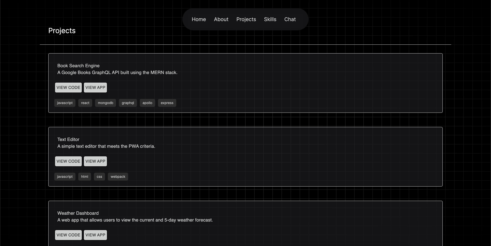
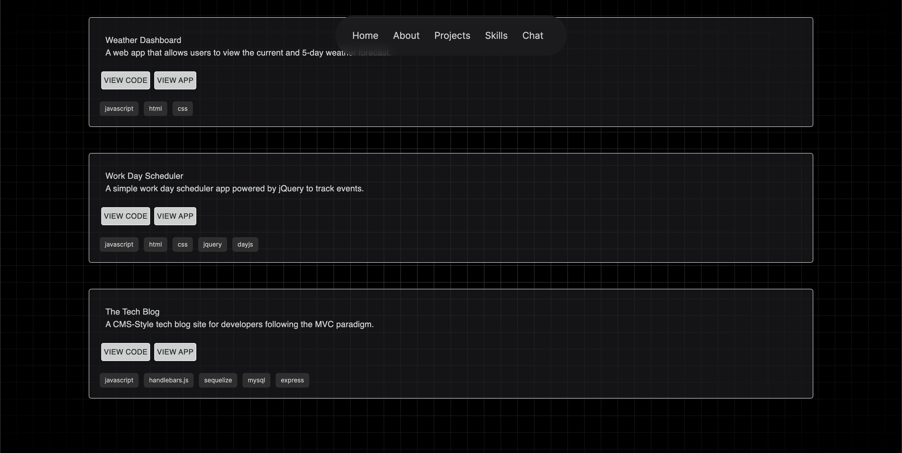
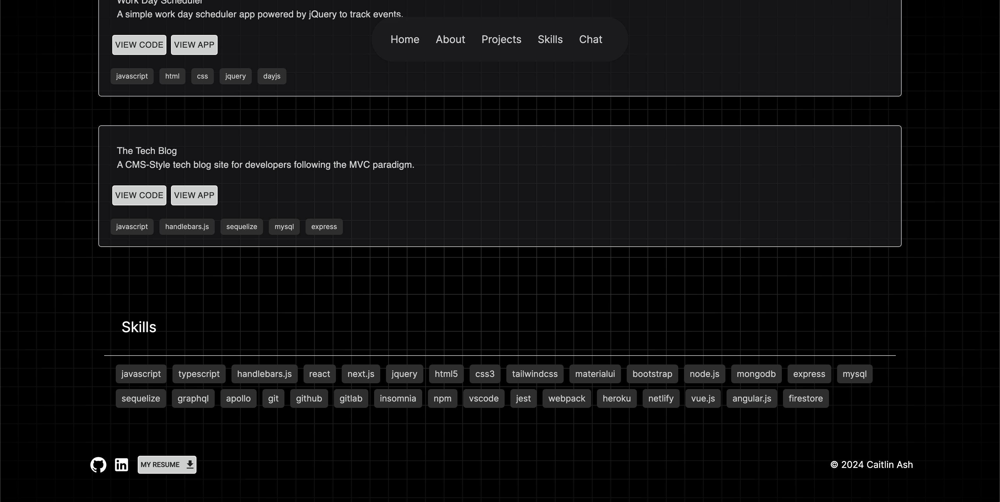
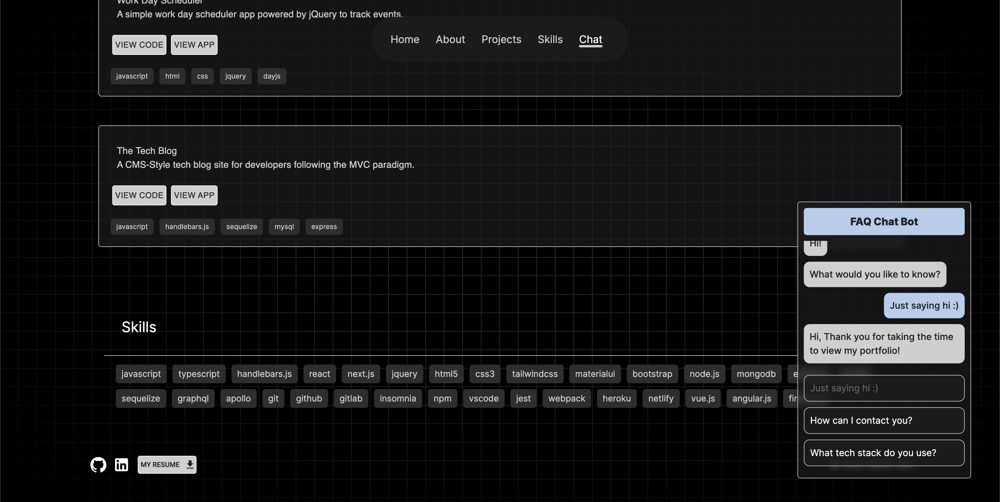

# Portfolio

## Description

This is a simple web portfolio built with Next.js and TypeScript to showcase and share my projects, skills, and a little bit about me. There is also a chat bot that can answer some questions you may have about myself as a developer! The styling of this portfolio was made with CSS Modules, TailwindCSS, and Material UI.

## Table of Contents

- [Installation](#installation)
- [Usage](#usage)
- [Credits](#credits)

## Installation 

To install this project, you will need to clone the repository from GitHub. You can do so by running the following command in your terminal: 'git clone --ssh copy--'

Once you have installed the necessary dependencies using 'npm install', you can run 'npm run dev' and this will start up the server. This will take you to the functioning app. 

OR

You can view and use the app via the deployed Netlify link. 

[Caitlin Ash | Portfolio](http://caitlin-ash.com/)

## Usage

Just simply click on each section of the navigation bar to navigate quickly between sections on the homepage!

## Credits

[Next.js Documentation](https://nextjs.org/)

[TailwindCSS Documentation](https://tailwindcss.com/)

[TypeScript Documentation](https://www.typescriptlang.org/docs/)

[Material UI Documentation](https://mui.com/material-ui/getting-started/)

